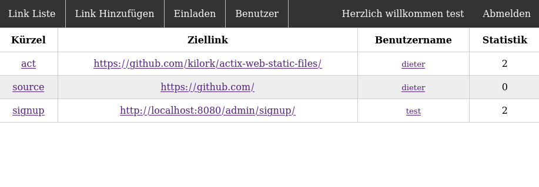

# Pslink a "Private Short Link page"

The target audience of this tool are small entities that need a url shortener. The shortened urls can be publicly resolved but only registered users can create short urls. Every registered user can see all shorted urls but ownly modify its own. Admin users can invite other accounts and edit everything that can be edited (also urls created by other accounts).



The Page comes with a basic commandline interface to setup the environment. If it is built with `cargo build release --target=x86_64-unknown-linux-musl` everything is embedded and it should be portable to any 64bit linux system.
Templates and migrations are embedded in the binary. So it should run standalone without anything extra.

## usage

### setup

To get Pslink up and running use the commands in the following order:

1. `pslink generate-env` this will generate a `.env` file in the curent directory with the default settings. Edit this file to your liking. You can however skip this step and provide all the parameters via commandline or environmentvariable. It is **not** recommended to provide PSLINK_SECRET with commandline parameters as they can be read by every user on the system.
2. `pslink migrate-database` will create a sqlite database in the location specified.
3. `pslink create-admin` create an initial admin user. As the page has no "register" function this is required to do anything usefull.
4. `pslink runserver` If everything is set up correctly this command will start the service.

### run the service

If everything is correctly set up just do `pslink runserver`.

### update

To update to a newer version execute the commands in the following order

1. stop the service
2. run `pslink migrate-database`
3. run the server again `pslink runserver`

### help

For a list of options use `pslink help`.

### systemd service file

If you want to automatically start this with systemd you can adjust the following template unit to your system. In this case a dedicated `pslink` user and group are used with the users home directory at `/var/pslink`. Some additional settings are in place to protect the system a little should anything go wrong.

```systemd
# /etc/systemd/system/pslink.service
[Unit]
Description=Pslink the Urlshortener
Documentation=https://github.com/enaut/Pslink
Wants=network.target
After=network.target

[Service]
User=pslink
Group=pslink
EnvironmentFile=-/var/pslink/.env

ProtectHome=true
ProtectSystem=full
PrivateDevices=true
NoNewPrivileges=true
PrivateTmp=true
InaccessibleDirectories=/root /sys /srv -/opt /media -/lost+found
ReadWriteDirectories=/var/pslink
WorkingDirectory=/var/pslink
ExecStart=/var/pslink/pslink runserver

[Install]
WantedBy=multi-user.target
```
