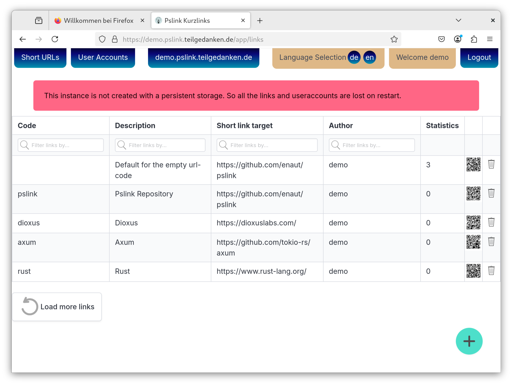

# Pslink a "Private Short Link page"

The target audience of this tool are small entities that need a url shortener. The shortened urls can be publicly resolved but only registered users can create short urls. Every registered user can see all shorted urls but only modify its own. Admin users can invite other accounts and edit everything that can be edited (also urls created by other accounts).

So in general this is more a shared short url bookmark webpage than a short url service.

## Demo

A demo instance is running under [https://demo.pslink.teilgedanken.de/app/](https://demo.pslink.teilgedanken.de/app/)

The Username and Password are both `demo`. Do not use this for any production use case as the database is wiped every 15 minutes. If your created links/users are suddenly missing this is due to such a database wipe.

[](https://pslink.teilgedanken.de/app/)
[](https://pslink.teilgedanken.de/app/)

## What users can do

* **Guests (no account):**

  * click on link, get redirected to the page
  * error on invalid or deleted link

* **Users (regular account):**

  * view all existing links
  * modify all own links
  * create new links
  * download qr-codes of the links
  * modify own "profile" settings

* **Admins (privileged account):**

  * everything from users
  * modify all links
  * list all users
  * modify all profiles
  * create new users
  * make users administrators
  * make administrators normal users

## What the program can do


* **Command line**

    * create and read from a `.env` file in the current directory
    * create and migrate the database
    * create an admin user
    * run the webserver

* **Service**

    * redirect according to the database
    * admin interface via wasm
    

## Usage

### Install the binary

The Pslink bundle can be downloaded from the latest release at: https://github.com/enaut/pslink/releases

Just extract the bundle where you like. A sample install might be:

```bash
# mkdir -p /opt/pslink
# cd /opt/pslink
# wget https://github.com/enaut/pslink/releases/latest/download/pslink-linux-x86_64-bundle.tgz
# tar -xf pslink-linux-x86_64-bundle.tgz
# /opt/pslink/pslink help
```

You could now adjust your `PATH` or setup an alias or just call the binary with the full path `/opt/pslink/pslink`

### Install with cargo

`cargo install pslink` does not (yet) produce a working binary! Use the "install binary" or "build from source" approach

### Build from source

Checkout the git repository and within its directory issue the following commands. Internet is required and some packages will be installed during the process.

```bash
$ cargo install dioxus-cli
$ dx bundle --release --package web
```

If that succeeds you should now be able to call Pslink. The binary is located at `target/dx/web/release/web/server`. The directory `target/dx/web/release/web/` can be moved wherever you want it to be.

**In the binary releases and in this README the `server` binary is renamed to `pslink`.**

### Configuration and setup

To read the help and documentation of additional options call:

```bash
 pslink help
```

To get Pslink up and running use the commands in the following order:

1. `pslink generate-env`

    this will generate a `.env` file in the current directory with the default settings. Edit this file to your liking.
    You can however skip this step and provide all the parameters via command line or environment variable.
    It is **not** recommended to provide `PSLINK_SECRET` with command line parameters as they can be read by every user on the system.

2. `pslink migrate-database`

    will create a sqlite database in the location specified in the .env file.

3. `pslink create-admin`

    create an initial admin user. As the page has no "register" function this is required to do anything useful. The command is interactive so you will be asked the username and password of the new admin user.

4. `pslink runserver`

    If everything is set up correctly this command will start the service. You should now be able to go to your url at [http://localhost/app/](http://localhost/app/) and you should be presented with a login screen where you can login with the credentials you just created (use the username not the email).

### Run the service

If everything is already correctly set up just do `pslink runserver` to launch the server.

### Update

To update to a newer version execute the commands in the following order

1. stop the service
2. download and install or build the new binary
3. run `pslink migrate-database`
4. run the server again `pslink runserver`

### Help

For a list of options use `pslink help`. If the help does not provide enough clues please file an issue at: [https://github.com/enaut/pslink/issues/new](https://github.com/enaut/pslink/issues/new). Feel free to do so even for simple questions, comments or requests!

### Installation on the server using systemd

While there are probably millions of ways to set up Pslink as a service on a server, here is an example using systemd.

In this case a dedicated `pslink` user and group is used with the users home directory at `/opt/pslink`.
Some additional settings are in place to protect the system a little should anything go wrong.

1. create the user
    ```bash 
    sudo adduser pslink --home-dir /opt/pslink
    ```
2. create the directory and change its owner and permissions
    ```bash
    sudo mkdir -p /opt/pslink
    sudo chown pslink:pslink /opt/pslink
    sudo chmod 700 /opt/pslink
    ```
3. create the initial config file and database
    ```bash
    cd /opt/pslink
    sudo -u pslink /opt/pslink/pslink generate-env
    sudo -u pslink /opt/pslink/pslink migrate-database
    sudo -u pslink /opt/pslink/pslink create-admin
    ```
4. create the systemd service file at `/etc/systemd/system/pslink.service` and adjust it to your liking:
    ```systemd
    cat /etc/systemd/system/pslink.service
    [Unit]
    Description=Pslink the Urlshortener
    Documentation=https://github.com/enaut/Pslink
    Wants=network.target
    After=network.target

    [Service]
    User=pslink
    Group=pslink
    EnvironmentFile=-/opt/pslink/.env

    ProtectHome=true
    ProtectSystem=full
    PrivateDevices=true
    NoNewPrivileges=true
    PrivateTmp=true
    InaccessibleDirectories=/root /sys /srv /media -/lost+found
    ReadWriteDirectories=/opt/pslink
    WorkingDirectory=/opt/pslink
    ExecStart=/opt/pslink/pslink runserver

    [Install]
    WantedBy=multi-user.target
    ```
5. start and install the service
    ```bash
    sudo systemctl enable --now pslink
    ```
6. check the log file for errors:
    ```bash
    sudo systemctl status pslink
    sudo journalctl -u pslink
    ```

### Docker and Podman

See the [Build Container](doc/BuildContainer.md) instructions.